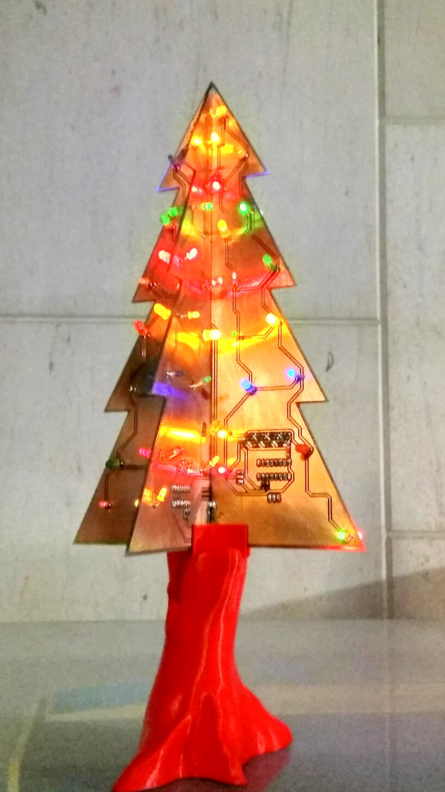

# :christmas_tree: :santa: :christmas_tree: DETI X-mas Tree :christmas_tree: :santa: :christmas_tree:

A **simple** (yet rather cool!) Christmas Tree using LEDs and Printed Circuit Boards.

## :gift: List of Material
:snowflake: 64 (or 128) LEDs (_preferably 5mm LEDs_)  
:snowflake: 1 Arduino Nano  
:snowflake: 24 BC557  
:snowflake: 4 JHC138 (or 74HCT138)  
:snowflake: SMD Resistors  
:snowflake: Double Layer Printed Circuit Boards  

## :triangular_ruler: Tree Dimensions
:snowflake:  Approximately an A4 paper sheet

## What we did...
:snowflake: [Arduino Code](Xmas_tree.ino/)  
:snowflake: [Schematic & Board](PCB)  
:snowflake: 3D printed parts: [The Original](https://www.thingiverse.com/thing:537944) and [Our version](https://github.com/NEEET-AAUAV/Xmas-Tree/tree/master/Support)

## How we did it?
The projected electrical circuit is similar to a LED matrix, allowing only one LED ON at any given time.   
To create the illusion of multiple LEDs on, the control algorithm toggles the desired LEDs, one by one, through the decoder hardware at a high frequency, therefore creating the illusion of multiple LEDs being on at the same time.  
A decoder IC is required to control the LEDs independently, enabling the creation of multiple and elaborated animation schemes.  

## Authors
:santa: [André Gradim](https://github.com/a-gradim)  
:santa: [Pedro Martins](https://github.com/k3rn3l-pan1c)  

### Other Elfs worth mention
:snowman: [Hugo Leal](https://github.com/HugoLeal)  
:snowman: [Beatriz Silva](https://github.com/b-dsilva)

--- 

Wanna get in contact?  
Reach us by email: neeetua@gmail.com

---

Created By [NEEET - Núcleo de Estudantes de Eletrónica e Telecomunicações](https://www.facebook.com/neeetaauav/)  
[Department of Electronics, Telecommunications and Informatics](https://www.ua.pt/deti/)  
[University of Aveiro](https://www.ua.pt/)  

